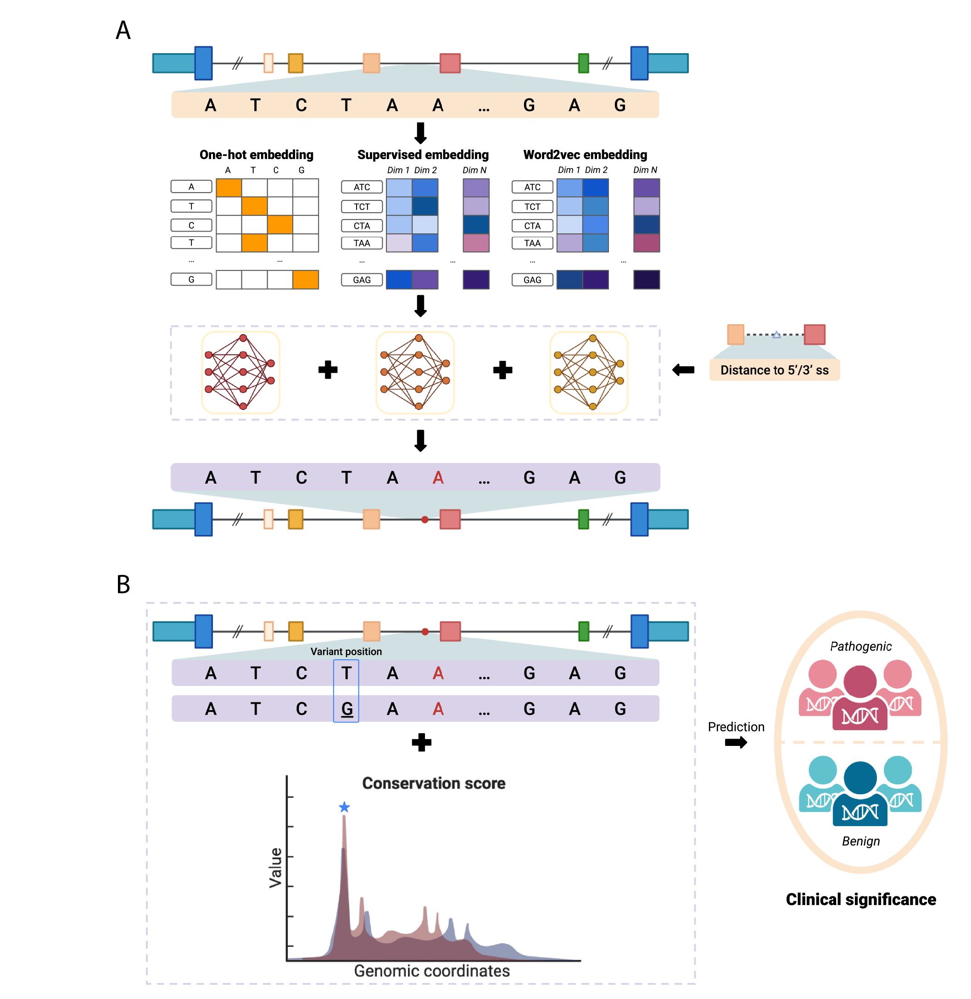
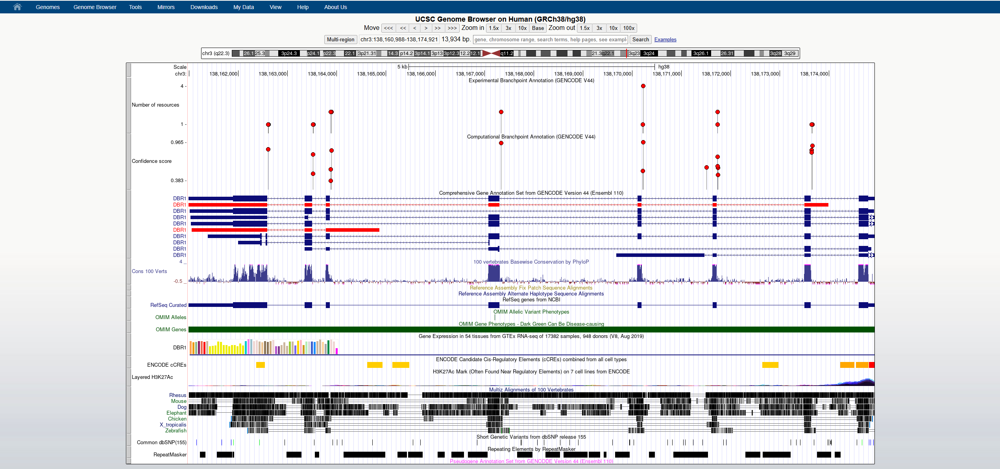

# Genome-wide annotation on functional Branchpoints in human genome

## Introduction
We developed an ensemble-based deep learning framework (**DeepEnsemble**) to predict intronic branchpoints, essential for RNA splicing, in the human genome. The model integrates sequence features and genomic distances to identify branchpoints within 70-nucleotide regions upstream of 3' splice sites. Additionally, we prioritized [ClinVar](https://www.ncbi.nlm.nih.gov/clinvar/intro/) branchpoint variants and extended the framework (**DeepEnsemble-LR**) to quantify the effects of SNVs on branchpoint functionality.


## Branchpoint annotation
Users can download pre-computed annotation files from the `data/bp_annotation` folder. Currently, two versions of annotations are available: one based on the GENCODE V19 (hg19) reference and another on the GENCODE V44 (hg38) reference. These annotations include both predicted (cbp) and experimental-based (ebp) branchpoints. The files are stored in an R-based object format and can be accessed once the [GenomicRanges](https://bioconductor.org/packages/release/bioc/html/GenomicRanges.html) package is installed. Examples of usage are provided below:
```r
library(GenomicRanges)

cbp_v44 <- readRDS("data/bp_annotation/gencode_v44_cbp.rds")
head(cbp_v44, 3)

GRanges object with 3 ranges and 7 metadata columns:
      seqnames    ranges strand |       model_window   BP_prob     transcript_id     tx_type intron_type intron_length          intron_gr
         <Rle> <IRanges>  <Rle> |          <GRanges> <numeric>       <character> <character> <character>     <integer>          <GRanges>
  [1]     chr1     12572      + | chr1:12543-12612:+  0.520336 ENST00000456328.2      lncRNA          U2           385 chr1:12228-12612:+
  [2]     chr1     12584      + | chr1:12543-12612:+  0.419528 ENST00000456328.2      lncRNA          U2           385 chr1:12228-12612:+
  [3]     chr1     12593      + | chr1:12543-12612:+  0.656099 ENST00000456328.2      lncRNA          U2           385 chr1:12228-12612:+
  -------
  seqinfo: 25 sequences from an unspecified genome; no seqlengths

ebp_v44 <- readRDS("data/bp_annotation/gencode_v44_ebp.rds")
head(ebp_v44, 3)

GRanges object with 3 ranges and 7 metadata columns:
      seqnames    ranges strand |              source  n_source     transcript_id     tx_type intron_type intron_length            intron_gr
         <Rle> <IRanges>  <Rle> |         <character> <integer>       <character> <character> <character>     <integer>            <GRanges>
  [1]     chr1    781910      + | eBP_Mercer,eBP_Zeng         2 ENST00000434264.6      lncRNA          U2          2844 chr1:779093-781936:+
  [2]     chr1    783082      + |            eBP_Zeng         1 ENST00000589899.5      lncRNA          U2          1067 chr1:782044-783110:+
  [3]     chr1    786361      + |            eBP_Zeng         1 ENST00000586928.5      lncRNA          U2          1899 chr1:784494-786392:+
  -------
  seqinfo: 25 sequences from an unspecified genome; no seqlengths
```

## Visualization in UCSC genome browser 
We also provide an option to access branchpoint annotations through the [UCSC Genome Browser](https://genome.ucsc.edu/). 
Click here for the [hg19](https://genome.ucsc.edu/s/yzhong/hg19_ebp_cbp) version and here for the [hg38](https://genome.ucsc.edu/s/yzhong/hg38_ebp_cbp) version. Users can bookmark these links for easy access in the future.


## Contact
This work is currently in progress during the manuscript preparation stage. For questions or support, please contact [yu_zhong@brown.edu](mailto:yu_zhong@brown.edu).